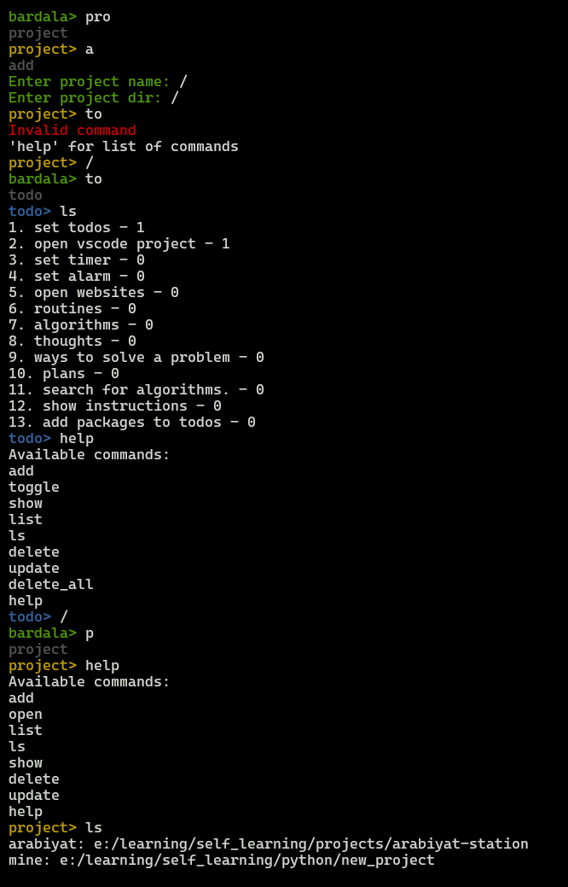

# Project Summary

This project is a personal command-line tool developed in Python, designed to manage various aspects of the user's life. It includes features for managing todos, routines, algorithms, thought logging, problem solving, planning, algorithm searching, and instructions. The project utilizes technologies such as Python, Command Line Interface (CLI), Visual Studio Code, Git, and GitHub. The development plan spans 15 days, with each day dedicated to a specific feature or set of features, following Object-Oriented Programming (OOP) principles. The program can be initiated by typing "bardala" in the command line and offers different modes for performing actions like adding, viewing, deleting, and updating items.

## Key Features

- Todo Management: Add, view, delete, update, and mark todos as done.
- Routine Management: Write routines for different situations (e.g., when feeling bored, facing a problem, etc.).
- Algorithm Setting: Set algorithms for time management and handling tasks you don't enjoy.
- Thought Logging: Write down your thoughts for future reference.
- Problem Solving: Write down ways you've solved specific problems.
- Planning: Write down your future plans.
- Algorithm Searching: Search for algorithms to solve current problems.
- Instructions: Write commands to show the program's instructions.

## Technologies Used

- Python
- Command Line Interface (CLI)
- Visual Studio Code
- Git
- GitHub

## Development Plan

The development process is planned over 15 days, with each day dedicated to a specific feature or set of features. The project will be developed using Object-Oriented Programming (OOP).

## Demo

## Demo

The demo provides a practical walkthrough of the command-line tool's functionality. The tool is designed to manage various aspects of a user's life, including projects and todos.

In the demo, the user navigates between different modes, such as project mode and todo mode, by entering simple commands. In each mode, the user can perform various actions like adding, listing, and updating items.

The tool also provides a help command in each mode, which displays a list of all available commands, making it user-friendly and easy to navigate.

Moreover, the tool is designed to handle invalid commands gracefully, guiding the user to use the help command to get a list of valid commands.

In summary, this tool serves as a comprehensive personal management system, offering a simple and intuitive command-line interface for managing projects and todos. It's a handy tool for anyone looking to organize their tasks and projects efficiently.